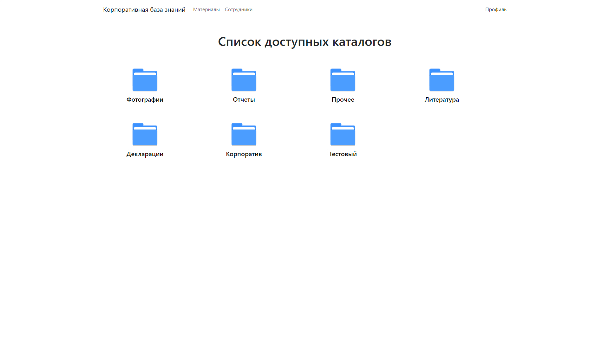
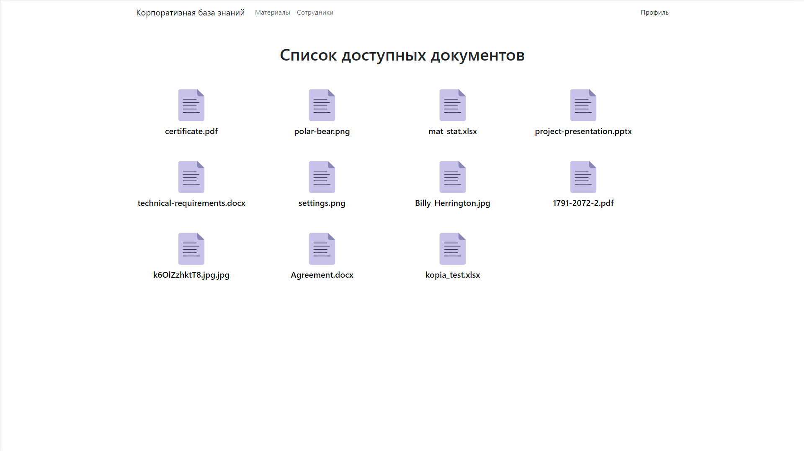
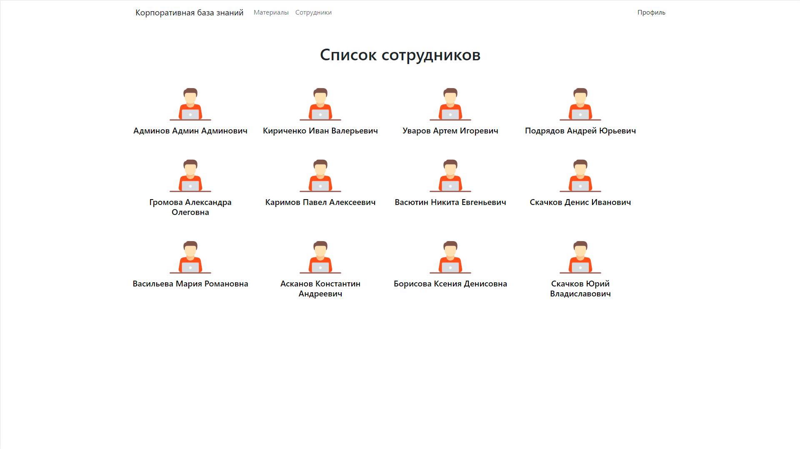
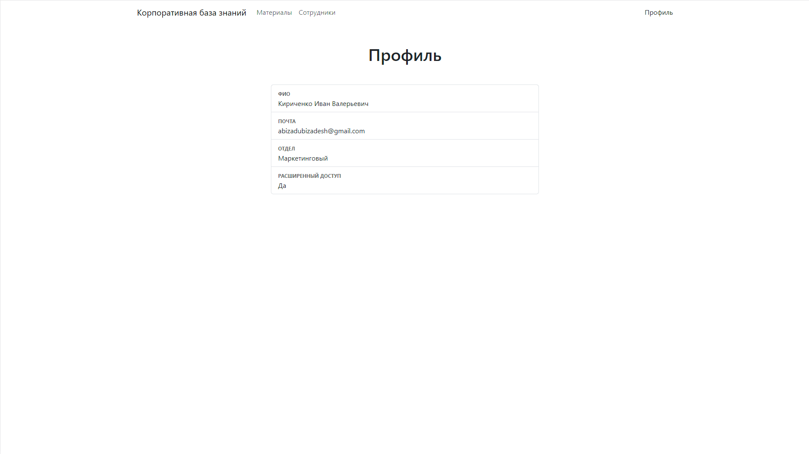

# Корпоративная база знаний для сотрудников компании

Площадка для сотрудников компании, на которой они могут получить доступ к обучающим и рабочим материалам. 

### Админ панель
- Создание и удаление каталогов
- Загрузка и удаление документов
- Ограничение доступа к документам
- Регистрация пользователей в системе. Пароль автоматически генерируется и отправляется на почту сотруднику

### Пользовательская сторона
- Каталоги. Пользователь видит каталоги, содержащие документы, к которым у него есть доступ. Администратор видит все каталоги.

- Документы. Пользователь видит документы, к которым у него есть доступ. Администратор видит все документы. Документ можно посмотреть и скачать, с помощью сервиса Яндекс.Документы.

- Список сотрудников. Здесь отображается список всех пользователей в системе.

- Профиль сотрудника. Информация о конкретном пользователе.
